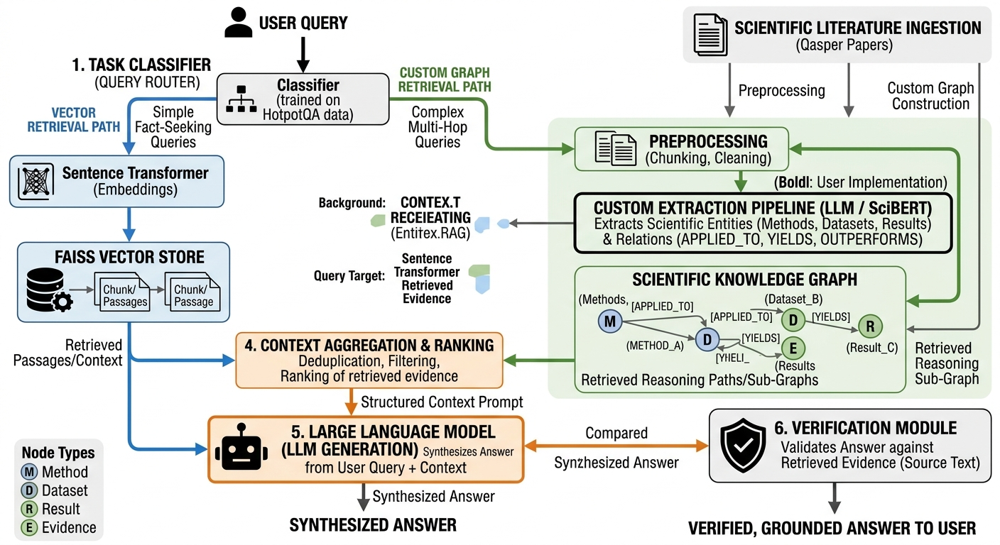

---

# 📌 Task-Adaptive Conflict-Aware Hybrid GraphRAG

### Multi-Hop Question Answering using Adaptive Fusion of Vector Retrieval and Knowledge Graph Reasoning

---

## 🚀 Overview

This repository contains the implementation of a **Task-Adaptive Hybrid GraphRAG system** for **multi-hop question answering (QA)**. The system combines:

* **Dense vector retrieval (semantic similarity)**
* **Knowledge graph-based relational reasoning**
* **Adaptive fusion mechanism**
* **Conflict detection + grounding verification**

Unlike traditional RAG systems that rely purely on vector similarity, this approach enables **structured reasoning across multiple documents**, significantly improving performance on **multi-hop queries**.

---

## ❗ Problem Statement

Large Language Models (LLMs) often suffer from:

* ❌ Hallucinations (ungrounded answers)
* ❌ Poor multi-hop reasoning
* ❌ Lack of relational understanding across documents

Traditional **Retrieval-Augmented Generation (RAG)** improves factual grounding but still fails at:

* Connecting **disjoint pieces of evidence**
* Performing **multi-step reasoning**
* Handling **contradictions in retrieved context**

### 💡 Our Goal

To design a system that:

* Dynamically selects the **best retrieval strategy**
* Combines **semantic + relational evidence**
* Detects **conflicting information**
* Produces **grounded, verifiable answers**

---

## 🧠 Our Approach

We propose a **Hybrid GraphRAG architecture** with the following pipeline:

```
Query 
 → Task Classification 
 → Parallel Retrieval (Vector + Graph)
 → Conflict Detection 
 → Adaptive Fusion 
 → Answer Generation 
 → Grounding Verification
```

### 🔑 Key Innovations

#### 1. Task-Adaptive Routing

Queries are classified into:

* Factual
* Multi-hop
* Yes/No
* Scientific

This determines how retrieval is performed.

---

#### 2. Hybrid Retrieval

* **Vector Retrieval**

  * FAISS-based semantic search
  * Sentence Transformers embeddings

* **Graph Retrieval**

  * Dynamically constructed knowledge graph
  * BFS traversal (depth = 2)
  * Entity-based reasoning

---

#### 3. Adaptive Fusion (Core Contribution)

Instead of fixed weighting, we compute:

[
C_{fused} = \alpha \cdot C_{vec} + (1 - \alpha) \cdot C_{graph}
]

Where:

* α is dynamically computed using:

  * Heuristic rules OR
  * Logistic Regression model

---

#### 4. Conflict Detection

We detect contradictions using:

* Named Entity mismatch
* Numeric inconsistencies

If conflict is detected:

* System falls back to the **more reliable source**

---

#### 5. Grounding Verification

Each generated answer is assigned:

* ✅ HIGH confidence
* ⚠️ MEDIUM confidence
* ❌ LOW confidence

Based on **token overlap with retrieved evidence**

---

## 🧩 System Architecture

The following diagram illustrates the complete **Task-Adaptive Hybrid GraphRAG pipeline**, showing both vector-based retrieval and knowledge graph reasoning paths:

<p align="center">
  
</p>

### 🔍 Key Components Explained

1. **Task Classifier (Query Router)**  
   - Routes queries into:
     - Simple (fact-based) → Vector Retrieval  
     - Complex (multi-hop/scientific) → Graph + Hybrid Retrieval  

2. **Vector Retrieval Path**  
   - Uses Sentence Transformers for embeddings  
   - FAISS index retrieves semantically similar chunks  

3. **Graph Retrieval Path**  
   - Constructs a dynamic **Scientific Knowledge Graph**  
   - Extracts:
     - Entities → Methods, Datasets, Results  
     - Relations → APPLIED_TO, YIELDS, OUTPERFORMS  
   - Performs BFS traversal to capture multi-hop reasoning  

4. **Context Aggregation & Ranking**  
   - Deduplicates overlapping chunks  
   - Ranks evidence from both retrieval paths  
   - Produces structured context for LLM  

5. **LLM Generation**  
   - Uses FLAN-T5 to synthesize answers  
   - Combines query + retrieved evidence  

6. **Verification Module**  
   - Validates generated answer against retrieved context  
   - Ensures:
     - Factual grounding  
     - Consistency  
     - Reliability
       
---  

## 📊 Results

### 🔥 HotpotQA (Multi-hop QA)

| System            | EM        | F1        |
| ----------------- | --------- | --------- |
| Vector RAG        | 0.220     | 0.397     |
| Hybrid (Adaptive) | **0.280** | **0.430** |

👉 **+27% EM improvement** over baseline 

---

### 📚 Qasper (Scientific QA)

| System     | EM    | F1    |
| ---------- | ----- | ----- |
| Vector RAG | 0.040 | 0.124 |
| Hybrid     | 0.040 | 0.118 |

👉 Performance limited by **retrieval recall bottleneck** 

---

## 🏗️ Implementation Details

### 🔧 Tech Stack

* Python 3
* HuggingFace Transformers (FLAN-T5)
* SentenceTransformers (all-MiniLM-L6-v2)
* FAISS (vector search)
* spaCy (NER)
* NetworkX (graph processing)
* scikit-learn (Logistic Regression)

---

### ⚙️ Key Design Choices

* CPU-only implementation (Kaggle compatible)
* No external APIs
* Fully reproducible pipeline
* Lightweight models for efficiency

---

## 📂 Project Structure

```
├── COGNITA.ipynb        # Main implementation notebook
├── README.md            # Documentation
└── Architecture.png              # (optional visualizations / outputs)
```

---

## 📦 Datasets Used

### 1. HotpotQA (Multi-hop QA)

* Wikipedia-based dataset
* Requires reasoning across multiple documents

👉 HuggingFace:
[https://huggingface.co/datasets/hotpot_qa](https://huggingface.co/datasets/hotpotqa/hotpot_qa)

---

### 2. Qasper (Scientific QA)

* QA over research papers
* Requires domain-specific reasoning

👉 HuggingFace:
[https://huggingface.co/datasets/allenai/qasper](https://huggingface.co/datasets/allenai/qasper)

---

## 📓 Kaggle Notebook

You can run the full pipeline here:

👉 [https://www.kaggle.com/code/snehapandit501/cognita](https://www.kaggle.com/code/snehapandit501/cognita)

---

## 📈 Evaluation Metrics

We use standard QA metrics:

* **Exact Match (EM)**
* **F1 Score**
* **Retrieval Recall**

---

## 🔍 Key Observations

* Adaptive systems outperform static architectures
* Graph-only retrieval is insufficient
* Retrieval quality defines system performance ceiling
* Multi-hop reasoning benefits heavily from graph traversal

---

## ⚠️ Limitations

* No co-reference resolution
* BFS limited to depth = 2
* Retrieval recall bottleneck (Qasper)
* Small evaluation subset (CPU constraints)

---

## 🔮 Future Work

* Co-reference resolution for better graph quality
* Neural adaptive routing (deep learning α)
* Larger models (7B+ LLMs)
* Evaluation on full datasets

---

## 👥 Authors

* Sneha Pandit
* Siansha Bhushan
* Sreejata Maity

PES University, Bengaluru


---


